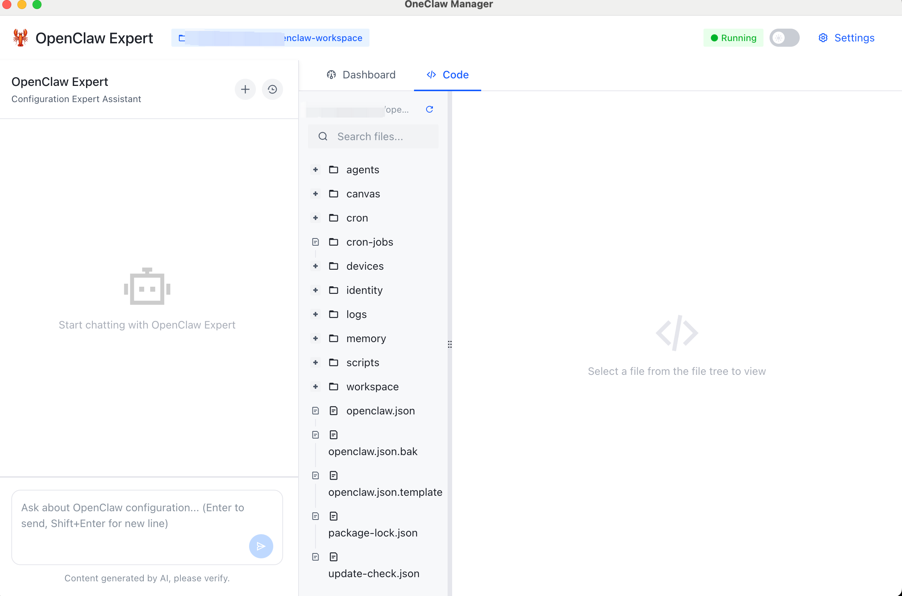

<div align="center">

# OneClaw Manager

**The Ultimate Desktop Manager for OpenClaw - Zero-Config, One-Click Setup!**

[](https://github.com/myersguo/oneClaw)
[](LICENSE)
[]()
[English](#english) | [中文](#中文)

## 🖥️ Desktop Interface



</div>

---

<a name="english"></a>
## 🚀 What is OneClaw?

**OneClaw** is a  powerful desktop/web management tool for [OpenClaw](https://openclaw.ai) - your personal AI assistant platform. Say goodbye to complex CLI commands and configuration files!

### ✨ Key Features

| Feature | Description |
|---------|-------------|
| 🎯 **One-Click Install** | Install and setup OpenClaw with a single click - no terminal needed! |
| 🖥️ **Visual Dashboard** | Real-time monitoring of gateway status, logs, and connected devices |
| 💬 **Integrated Chat** | Talk to your OpenClaw AI assistant directly from the desktop app |
| 📝 **Code Editor** | Built-in Monaco editor for managing configuration files |
| 🔄 **Auto Management** | Start, stop, and restart OpenClaw gateway with one button |
| 🌐 **Cross-Platform** | Native support for macOS, Windows, and Linux |

### 🎬 Quick Start

```bash
# Clone the repository
git clone https://github.com/myersguo/oneClaw.git
cd oneClaw

# Install dependencies
pnpm install

# Start the application
pnpm dev
```

That's it! The OneClaw Manager will automatically detect your OpenClaw installation and guide you through the setup process.

### 🏗️ Architecture

```
┌─────────────────────────────────────────────────────────┐
│                    OneClaw Desktop                      │
│  ┌──────────┐  ┌──────────┐  ┌──────────┐  ┌─────────┐  │
│  │ Dashboard│  │   Chat   │  │  Editor  │  │ Settings│  │
│  └──────────┘  └──────────┘  └──────────┘  └─────────┘  │
└──────────────────────┬────────────────────────────────────┘
                       │ Electron IPC
                       ▼
┌─────────────────────────────────────────────────────────┐
│                   Backend Server                        │
│              (Node.js + Express)                        │
└──────────────────────┬────────────────────────────────────┘
                       │
                       ▼
┌─────────────────────────────────────────────────────────┐
│                   OpenClaw Gateway                    │
│            (Your AI Assistant Platform)                 │
└─────────────────────────────────────────────────────────┘
```

---

<a name="中文"></a>
## 🚀 OneClaw 是什么？

**OneClaw** 是一个功能强大的桌面端/网页管理工具，用于 [OpenClaw](https://openclaw.ai) - 你的个人 AI 助手平台。告别复杂的命令行和配置文件！

### ✨ 核心特性

| 特性 | 描述 |
|---------|-------------|
| 🎯 **一键安装** | 一键安装和配置 OpenClaw - 无需终端！ |
| 🖥️ **可视化仪表板** | 实时监控网关状态、日志和连接设备 |
| 💬 **集成聊天** | 直接从桌面应用与你的 OpenClaw AI 助手对话 |
| 📝 **代码编辑器** | 内置 Monaco 编辑器管理配置文件 |
| 🔄 **自动管理** | 一键启动、停止和重启 OpenClaw 网关 |
| 🌐 **跨平台** | 原生支持 macOS、Windows 和 Linux |

### 🎬 快速开始

```bash
# 克隆仓库
git clone https://github.com/myersguo/oneClaw.git
cd oneClaw

# 安装依赖
pnpm install

# 启动应用
pnpm dev
```

就这些！OneClaw 管理器将自动检测你的 OpenClaw 安装并引导你完成设置过程。

### 🏗️ 架构

```
┌─────────────────────────────────────────────────────────┐
│                    OneClaw 桌面端                        │
│  ┌──────────┐  ┌──────────┐  ┌──────────┐  ┌─────────┐  │
│  │  仪表板   │  │   聊天   │  │  编辑器   │  │  设置   │  │
│  └──────────┘  └──────────┘  └──────────┘  └─────────┘  │
└──────────────────────┬────────────────────────────────────┘
                       │ Electron IPC
                       ▼
┌─────────────────────────────────────────────────────────┐
│                   后端服务                               │
│              (Node.js + Express)                        │
└──────────────────────┬────────────────────────────────────┘
                       │
                       ▼
┌─────────────────────────────────────────────────────────┐
│                   OpenClaw 网关                         │
│                 (你的 AI 助手平台)                      │
└─────────────────────────────────────────────────────────┘
```

---

## 🤝 Contributing

We welcome contributions! Please read our [Contributing Guide](CONTRIBUTING.md) for details.

欢迎贡献！请阅读我们的[贡献指南](CONTRIBUTING.md)。

## 📄 License

This project is licensed under the MIT License - see the [LICENSE](LICENSE) file for details.

本项目采用 MIT 许可证 - 详情请查看 [LICENSE](LICENSE) 文件。

---

<div align="center">

**Made with ❤️ by the OneClaw Team**

[⭐ Star us on GitHub](https://github.com/myersguo/oneClaw) |

</div>
